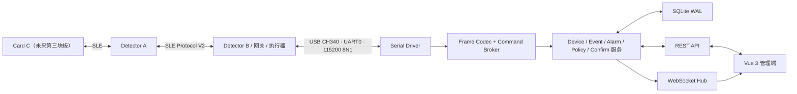

# SLE-ID 管理端后端与硬件通信方案（审阅版 V1）

版本：2026-08-09  
依据：`D:\naiwa1\SLE-ID-Admin-Backend\SLE-ID-Admin-Backend\StarFollow-Admin` 当前前端、`server/README.md` 与硬件 Protocol V2  
状态：方案已落地为第一版可运行后端；真实 B 板串口联调待执行

## 1. 推荐定案

本项目第一版采用以下架构，不引入云服务和微服务：

1. 管理后端使用 **Node.js 20 + TypeScript + Express + better-sqlite3 + ws + serialport**。
2. 后端作为 Windows 本机单进程运行，只监听 `127.0.0.1:8080`。
3. 生产运行时由后端同时提供 REST、WebSocket 和前端 `dist/` 静态文件，页面统一从 `http://127.0.0.1:8080` 打开。
4. 电脑只通过一根 USB 连接 **Detector B**；Detector A 与未来 Card 通过 SLE 接入系统，不直接连接管理端。
5. 电脑与 B 使用现有 **Protocol V2 二进制定长头帧**，不改为 JSON、AT 文本命令或按行协议。
6. 前端查询和操作走 REST；实时设备、事件、报警、确认与策略结果走 WebSocket。浏览器不直接访问串口。
7. SQLite 是第一版唯一业务数据源；B 的 RAM 可靠队列负责短时断线补传，但不替代数据库。

这套链路与当前硬件实现最贴合，也便于前端队友使用 TypeScript 维护。第一版不建议使用 Java/Spring、Python 多进程、MQTT 或远程云数据库。

## 2. 总体链路



运行时只有后端进程拥有 B 的 COM 口。VS Code 串口监视器、烧录工具和后端不能同时打开同一个 COM 口；测试日志时应先停止后端串口连接。

## 3. 后端边界

### 3.1 模块划分

建议 `server/` 使用以下结构：

```text
server/
├── package.json
├── tsconfig.json
├── src/
│   ├── index.ts                  # 进程启动、关闭顺序
│   ├── app.ts                    # Express、REST、静态前端
│   ├── config.ts                 # 端口、数据库、串口配置
│   ├── db/
│   │   ├── connection.ts         # SQLite WAL/事务
│   │   ├── migrations/           # 带版本迁移
│   │   └── repositories/         # 数据访问层
│   ├── serial/
│   │   ├── port-manager.ts       # 发现、识别、独占、重连
│   │   ├── frame-codec.ts        # Protocol V2 编解码/CRC
│   │   ├── stream-parser.ts      # 字节流重同步
│   │   ├── gateway-session.ts    # 心跳、在线状态
│   │   └── command-broker.ts     # requestId、超时、重试、回执
│   ├── services/
│   │   ├── device-service.ts
│   │   ├── event-service.ts
│   │   ├── alarm-service.ts
│   │   ├── policy-service.ts
│   │   ├── confirm-service.ts
│   │   ├── card-service.ts
│   │   └── invite-service.ts
│   ├── routes/                   # 与前端 api/*.ts 对应
│   ├── ws/ws-hub.ts
│   └── jobs/                     # 离线判定、过期许可、备份
├── data/starfollow.db
└── logs/
```

第一版保持模块化单体。串口吞吐很低，Node 事件循环配合同步 SQLite 事务足够，不需要消息队列或独立串口微服务。

### 3.2 启动顺序

1. 加载配置并检查数据目录权限；
2. 打开 SQLite，执行迁移并启用 WAL；
3. 启动 REST/WebSocket；
4. 根据保存的 COM 口连接 B；失败不阻止管理页面启动；
5. 启动 Host 心跳、设备离线判定和数据库备份任务；
6. 关闭时先停止接收新命令，再关闭串口、WebSocket 和数据库。

## 4. 电脑与 B 的通信定案

### 4.1 物理层

| 项目 | 约定 |
|---|---|
| 连接对象 | 电脑 USB 只连接 Detector B 的板载 CH340/UART0 |
| 串口参数 | `115200 / 8 data bits / no parity / 1 stop bit / no flow control` |
| 数据形式 | 原始二进制字节流，不附加 CR/LF |
| 串口所有权 | 后端独占；烧录/串口监视前先释放 |
| 自动识别 | 枚举串口后发送 Host 心跳，只接受能返回 `sourceRole=3` 心跳的端口 |
| 自动重连 | 1 秒、2 秒、5 秒、10 秒退避，成功后恢复 1 秒 |

不能只按 `USB-SERIAL CH340` 名称自动选择，因为 A、B 两块板可能使用相同芯片。必须用 Protocol V2 心跳识别 B；用户手动选择的 COM 口仍需二次校验角色。

### 4.2 Protocol V2 帧

```text
offset  size  field
0       2     magic = 0x53 0x4C  ("SL")
2       1     version = 2
3       1     messageType
4       1     flags
5       1     sourceRole
6       4     sourceId       uint32 little-endian
10      4     bootId         uint32 little-endian
14      4     messageId      uint32 little-endian
18      2     payloadLength  uint16 little-endian, 0..64
20      N     payload
20+N    2     CRC16-CCITT
```

CRC 初值 `0xFFFF`、多项式 `0x1021`，覆盖 `version` 到 payload，排除 magic 和 CRC 本身。流解析器按 magic 重同步，并以版本、角色、长度和 CRC 四重校验过滤文本日志及错位字节。

### 4.3 当前正式消息

| 方向 | 类型 | 用途 | 可靠性 |
|---|---:|---|---|
| B → Host | `HEARTBEAT 0x30` | B 在线、固件、策略版本、队列与运行状态 | 每秒发送，不要求 ACK |
| Host → B | `HEARTBEAT 0x30` | 维持 B 的 `backend_online` | 每秒发送，空 payload |
| Host → B | `POLICY_SYNC 0x60` | 下发当前 B 可执行的策略摘要 | requestId 幂等，等待结果 |
| B → Host | `POLICY_RESULT 0x61` | 策略版本与应用状态 | requestId 对应 |
| B → Host | `EVENT_REPORT 0x62` | 最终事件 | `ACK_REQUIRED` |
| B → Host | `ALERT_REPORT 0x63` | 报警事件 | `ACK_REQUIRED` |
| B → Host | `CONFIRM_REQUEST 0x64` | 请求管理端批准/拒绝 | `ACK_REQUIRED` |
| Host → B | `CONFIRM_RESULT 0x65` | 返回确认结论 | requestId + eventId 幂等 |
| B → Host | `COMMAND_RESULT 0x66` | 通用命令处理状态 | requestId 对应 |
| 双向 | `ACK 0x7F` | 确认可靠上报帧 | 原 messageId + status |

第一版不新增第二套通信格式。后续消息仍在 Protocol V2 中扩展，并保持未知消息安全忽略、能力明确返回。

### 4.4 ACK 与数据库提交顺序

收到 `EVENT_REPORT`、`ALERT_REPORT` 或 `CONFIRM_REQUEST` 后必须按以下顺序处理：

1. 验证帧头、长度、CRC、来源和 payload；
2. 开启 SQLite 事务；
3. 使用唯一键写入或确认记录已存在；
4. 提交事务；
5. 成功写入回复 `ACK_ACCEPTED`，已存在回复 `ACK_DUPLICATE`；
6. 提交失败不 ACK，让 B 使用相同 messageId 重试；
7. 数据持久化后再推送 WebSocket。

不能在数据库提交前 ACK，否则后端在 ACK 后崩溃会永久丢失事件。

### 4.5 心跳与在线判定

- Host 每 1000 ms 向 B 发一个空 payload 心跳；B 超过 5000 ms 未收到 Host 帧即认为后端离线。
- B 每 1000 ms 向 Host 发 20 字节心跳；后端超过 3500 ms 未收到 B 心跳，将 B 标记离线，但保留串口继续等待。
- 串口被拔出时立即设置 `SerialStatus.connected=false` 和 B 离线。
- `Device.heartbeat` 返回“距最近心跳秒数”，不是设备时间戳。
- B 重启后 bootId 改变，后端立即开始新的设备会话；旧事件仍保留。

### 4.6 幂等键

| 对象 | 唯一键 |
|---|---|
| 原始帧 | `frame.sourceId + frame.bootId + frame.messageId` |
| 通行事件 | payload 中的 `sourceId + bootId + eventId` |
| 管理端事件 ID | `EV-{sourceId}-{bootId}-{eventId}` |
| 确认请求 | `B sourceId + B bootId + requestId` |
| Host 命令 | `Host bootId + commandType + requestId` |

`EVENT_REPORT` 的帧发送者是 B，但事件 payload 中的 sourceId/bootId 属于 A。事件唯一键必须使用 payload 的事件来源，不能使用帧头中的 B 身份。

### 4.7 命令规则

- Host `sourceId` 使用安装时生成并持久化的非零 uint32；Host `bootId` 每次后端启动随机生成。
- messageId 在单次 Host bootId 内单调递增并跳过 0。
- requestId 使用数据库分配的非零 uint32，不按当前时间截断生成。
- 策略命令超时 1500 ms 后可用**相同 requestId 和相同 payload**重发，最多 3 次。
- 同 requestId 但 payload 不同必须视为冲突，禁止覆盖。
- 确认只允许处理一次；批准/拒绝后禁止用同 requestId 改判。

### 4.8 二次确认时限

B 的确认窗口当前为 10 秒。后端以最近 B 心跳建立“设备 uptime → 主机 UTC”的近似映射，再利用确认 payload 中的设备时间计算真实剩余时间。UI 建议只开放到 B 截止时间前 500 ms；超时后按钮立刻禁用，后端不得把迟到批准重试成成功。

## 5. SQLite 数据模型

SQLite 设置：`journal_mode=WAL`、`foreign_keys=ON`、`busy_timeout=5000`；事件量不大，建议 `synchronous=FULL`，保证 ACK 前落盘。

### 5.1 核心表

| 表 | 关键字段与约束 |
|---|---|
| `schema_migrations` | `version` 唯一，记录迁移 |
| `serial_settings` | 选定 COM、波特率、自动重连、更新时间 |
| `devices` | `source_id` 主键；名称、位置、角色、固件、策略版本、最后心跳、最后 bootId |
| `device_sessions` | `(source_id, boot_id)` 唯一；启动/结束/uptime |
| `events` | `event_key` 主键；事件源三元组唯一；卡片、许可、动作、确认、执行、原因、设备时间、主机接收 UTC |
| `alarms` | `id` 主键；`event_key` 外键；类型、级别、处理状态、操作员、处理时间 |
| `confirmations` | `(gateway_source_id, gateway_boot_id, request_id)` 唯一；event_key、截止时间、结果、完成时间 |
| `licenses` | 前端许可字段、`hardware_permission_id`、策略 JSON、能力状态、版本、同步状态 |
| `license_scopes` | 许可与设备/区域的多对多范围 |
| `cards` | 匿名 cardId、持有人、许可、状态、keyVersion、lastSync；不保存明文密钥 |
| `invites` | code 唯一、角色、过期、使用/撤销状态与审计字段 |
| `device_commands` | requestId、命令类型、payload hash、状态、尝试次数、回执、错误、创建/完成时间 |
| `audit_logs` | 管理员写操作、对象、前后值摘要、时间 |

日期统一以 UTC ISO-8601 存储，响应前端时再格式化为本地时间。设备 `timestamp_ms` 是单调 uptime，必须单独保存，不能直接转换成日历日期。

### 5.2 密钥边界

当前管理前端可管理卡片元数据，但后端第一版不把 Card 的原始 HMAC 密钥明文写入 SQLite。真实写卡仍使用现有写卡工具或后续受保护的凭证模块。若后续必须由后端保管密钥，应使用 Windows DPAPI/独立密钥库加密，并与普通数据库备份分离。

## 6. REST API 设计

所有响应统一为：

```json
{ "code": 0, "message": "ok", "data": {} }
```

非零业务码仍返回合适 HTTP 状态；前端 Axios 拦截器读取 `code/message/data`。

### 6.1 当前页面所需接口

| 方法 | 路径 | 对应前端 |
|---|---|---|
| GET | `/api/health` | 后端健康检查 |
| GET | `/api/events` | EventLog、Home 最近事件；支持现有分页筛选 |
| GET | `/api/alarms` | AlarmCenter 列表与统计 |
| POST | `/api/alarms/:id/handle` | 标记处理/忽略/升级 |
| GET | `/api/devices` | DeviceManage |
| GET | `/api/devices/ws63-status` | WS63/SLE 状态摘要 |
| GET | `/api/devices/serial-status` | 首页串口状态 |
| POST | `/api/devices/:id/restart` | 当前硬件不支持，返回明确能力错误 |
| GET | `/api/licenses` | PermissionManage |
| POST | `/api/licenses` | 创建许可并保存完整 10 项策略 |
| POST | `/api/licenses/:id/revoke` | 吊销许可，进入同步队列 |
| POST | `/api/licenses/:id/deploy` | 向指定 B 发布支持的策略摘要 |
| GET | `/api/cards` | CardLicenseManage |
| POST | `/api/cards/:cardId/actions` | freeze/lost/revoke/restore；返回同步状态 |
| GET | `/api/invites` | InviteManage |
| POST | `/api/invites` | 创建邀请码 |
| POST | `/api/invites/:id/revoke` | 撤销邀请码 |
| GET | `/api/system/settings` | SystemSettings |
| PATCH | `/api/system/serial` | 切换串口配置并重连 |
| GET | `/api/system/serial-ports` | 枚举串口 |
| PATCH | `/api/system/server-sync` | 第二版云同步预留开关 |

### 6.2 确认闭环新增接口

当前前端没有确认操作页面，但硬件已支持，应新增：

| 方法 | 路径 | 用途 |
|---|---|---|
| GET | `/api/confirmations/pending` | 页面重连后恢复未过期确认 |
| POST | `/api/confirmations/:id/decision` | `{decision:"approve"|"reject"}` |

确认写接口先使用数据库原子条件更新抢占一次性决定，再发串口，避免两名操作员同时作出相反决定。最终状态以 B 的命令结果/事件终态为准。

## 7. WebSocket 设计

地址固定为 `/ws/events`。只用于后端向页面推送状态；所有修改操作仍使用 REST，避免 WebSocket 命令难以审计和重试。

统一消息包：

```json
{
  "version": 1,
  "seq": 1024,
  "topic": "event.upsert",
  "sentAt": "2026-08-09T03:40:20.123Z",
  "data": {}
}
```

第一版 topic：

- `serial.status`
- `device.upsert`
- `event.upsert`
- `alarm.created`
- `alarm.updated`
- `confirmation.pending`
- `confirmation.resolved`
- `policy.result`

WebSocket 只保证实时体验，不作为数据库。页面断线重连后必须通过 REST 重新拉取当前数据和 pending confirmations，不能依赖补齐所有 WS 消息。

## 8. 前端模型与真实能力差异

### 8.1 已能真实接入

- B 在线、固件、策略版本、运行时长与串口状态；
- 最终事件日志；
- 告警生成和处理；
- 基础策略发布结果；
- 管理端强制确认；
- 短时 USB 断线后的 RAM 队列补传。

### 8.2 不能返回“成功”的功能

| 前端能力 | 当前实际状态 | 第一版处理 |
|---|---|---|
| `restartDevice` | 没有硬件重启消息 | 返回 `CAPABILITY_UNSUPPORTED`，页面禁用按钮 |
| 10 项完整策略 | B 仅支持执行、两类确认、离线、拒绝报警 | 保存完整策略，发布时返回每项支持等级 |
| 多许可同时驻留 B | 当前 B 只有一套活动 permission/policy | 第一版每个 B 只部署一个活动策略 |
| 卡片冻结/挂失实时下发 | Host→B→A→Card 管理链路未实现 | 更新数据库为 `pending_sync`，不得伪造 lastSync |
| 多检测端在线状态 | Host 只有 B 的周期心跳 | A 可由事件 lastSeen 推断，不能等同于周期在线 |
| 实时五阶段生命周期 | 当前只上报最终事件 | 页面先显示最终 `COMPLETED`；中间态待协议扩展 |
| 执行器反馈 | 当前 GPIO 发出高电平即记执行 | UI 标注“指令已输出”，不能当作门锁物理成功 |

### 8.3 建议的后续硬件扩展

保持 Protocol V2，不另起协议：

- `NODE_STATUS`：B 周期上报 A/Card 链路与最后活动时间；
- `DEVICE_CONTROL / DEVICE_CONTROL_RESULT`：受保护的重启与诊断命令；
- `POLICY_BUNDLE_BEGIN/ITEM/COMMIT`：多许可原子下发；
- `CARD_STATE_SYNC`：卡片状态同步与明确回执；
- `ACTUATOR_FEEDBACK`：外部执行器真实反馈；
- 将 B 的 32 条 RAM 队列升级为 Flash 256 条。

这些扩展应在后端基本链路跑通后逐项加入，不阻塞事件、报警、确认和基础策略的第一版联调。

## 9. 前端最小必要修改

接入后端无法做到前端零修改，因为当前 `api/*.ts` 全部调用 mock，且 `vite.config.ts` 实际没有 README 所称的 `/api` 代理。建议只做以下集中修改：

1. 将各 `api/*.ts` 的 mock 调用替换为 `request.get/post/patch`；保留 `VITE_USE_MOCK=true` 作为演示模式。
2. 开发环境在 Vite 增加 `/api` 和 `/ws` 到 `http://127.0.0.1:8080` 的代理；生产环境使用后端同源静态托管。
3. 启用 `connectEventSocket('/ws/events')`，增加断线重连和 REST 重新同步。
4. 增加 pending confirmation 卡片/弹窗及倒计时。
5. 给策略和卡片增加 `syncStatus/capability` 显示，区分已保存、待下发、部分支持、已生效、失败。
6. `WS63Status.latency` 改为 `number | null`，没有真实测量时显示 `--`，不能返回虚构数字。
7. `adminSecret` 不回传原值，只允许提交新密码；页面显示固定掩码。

## 10. 错误码建议

| code | 含义 |
|---:|---|
| 0 | 成功 |
| 1001 | 参数错误 |
| 1002 | 资源不存在 |
| 2001 | 串口未连接 |
| 2002 | 目标不是 Detector B |
| 2003 | 帧 CRC/格式错误 |
| 2004 | B 离线 |
| 2101 | 命令超时 |
| 2102 | requestId 冲突 |
| 2103 | B 返回 BUSY |
| 2104 | 策略版本过旧 |
| 2201 | 确认已过期 |
| 2202 | 确认已处理 |
| 3001 | 部分策略不受硬件支持 |
| 3002 | `CAPABILITY_UNSUPPORTED` |
| 4001 | 数据库事务失败 |

## 11. 安全与运维

- 第一版只绑定 `127.0.0.1`，不开放局域网；不配置 CORS 通配符。
- 所有管理写操作记录 `audit_logs`；串口 payload 日志默认脱敏 cardId，不打印密钥。
- SQLite 每天生成一致性备份，保留最近 7 份；备份失败不影响实时链路但必须报警。
- 管理密码使用 `scrypt`/Argon2 哈希；API 不返回 `adminSecret`。
- 前后端日志使用轮转文件，限制大小；原始帧只保留短期诊断摘要。
- 收到未知 sourceId 时先落入 `unregistered` 设备并产生 `unknown_device` 告警，不能自动授予权限。

## 12. 实施顺序与验收门槛

### 阶段 B0：后端骨架

- Express、统一响应、SQLite 迁移、健康检查、静态前端；
- 验收：重启后数据保留，前端可访问 `/api/health`。

### 阶段 B1：单 USB 驱动

- 串口枚举、B 角色识别、帧解析、CRC、双向心跳、自动重连；
- 验收：只连接 B，拔插 USB 后自动恢复，A 的 COM 不会被误选。

### 阶段 B2：事件与报警

- 事务落库后 ACK、幂等、REST 查询、WebSocket 推送；
- 验收：重复帧只产生一条事件；数据库失败时 B 保留并重试。

### 阶段 B3：策略与确认

- 命令 broker、基础策略能力编译、回执、确认倒计时与一次性决定；
- 验收：策略收到 `POLICY_RESULT` 才显示已生效；迟到确认被拒绝。

### 阶段 B4：前端替换 Mock

- API 切换、WS 重连、支持等级与同步状态；
- 验收：关闭 mock 后全部当前页面可打开，未实现能力明确禁用/提示。

### 阶段 B5：硬件扩展

- 多许可、卡片同步、节点状态、执行器反馈、Flash 补传；
- 验收按新增消息逐项进行，不与 B0-B4 混在一次大改中。

## 13. 建议审阅结论

建议项目组确认以下 6 项后开工：

1. 后端技术栈定为 Node.js + TypeScript 模块化单体；
2. 生产端口定为 `127.0.0.1:8080`，后端同源托管前端；
3. 运行时只接 B 的单 USB，115200/8N1，继续使用 Protocol V2 二进制帧；
4. ACK 定义为“SQLite 已持久化”，不是“内存已收到”；
5. 第一版每个 B 只部署一套活动策略，完整 10 项策略保存在数据库并显示能力等级；
6. 卡片状态同步、设备重启、多节点心跳和执行器反馈列为后续 Protocol V2 扩展，第一版不伪造成功。

若这 6 项通过，即可按 B0 → B4 顺序实现；硬件端当前无需为后端骨架再次改版。
