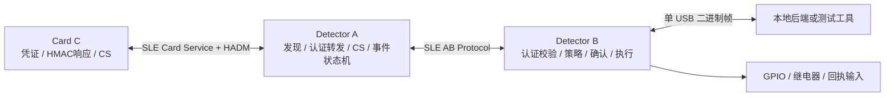

# SLE 无感项目硬件端 V1 改进方案

版本：V1.1  
基线日期：2026-08-08  
适用设备：Detector A、Detector B、WS63 Card C

## 1. 最终结论

当前工程已经完成两块 H3863 之间的真实 SLE 通信，以及串口输入驱动的事件、策略、确认和 GPIO 脉冲演示。它是有效的 V0 双板样机，但还不是初版需求中的真实三端硬件闭环。

本轮确定采用以下方案：

1. 增加第三块 WS63/H3863 开发板，作为独立 Card C；优先购买与现有两块板相同的型号，减少 SDK、烧录器和引脚差异。
2. A 保留 SLE Central/Client 角色，维护到 B 的常驻链路，并增加到 Card C 的发现、连接、认证和 CS 链路。
3. B 保留 SLE Peripheral/Server 角色，作为认证、许可、二次确认、执行和 USB 网关的最终权威。
4. Card C 作为 SLE Peripheral/Server，提供写卡、凭证状态、挑战响应和 CS 响应能力。
5. 管理端和手机尚未接入时，使用测试工具模拟写卡、策略同步和确认，但消息格式必须直接沿用正式协议，禁止再增加一套只供演示的业务协议。
6. Channel Sounding 先进行独立能力验证。当前 SDK 暴露 HADM/CS 的 IQ、RSSI 和 TOF 接口，但 `CONFIG_FEATURE_GLE_HADM` 默认关闭且没有现成样例；只有 A 与 Card 真机产生稳定数据后，才把 H3 标记为完成。

目标链路如下：



## 2. 初版文档要求与当前差距

| 阶段 | 初版要求 | 当前状态 | 判定 |
|---|---|---|---|
| H0 基础通信 | Card/A/B 三类设备互认并收发测试帧 | A/B 已真实连接；Card 不存在 | 部分完成 |
| H1 卡片凭证存储 | 多许可、版本、校验、原子写入、冻结/撤销、写入回执 | 已完成 8 项许可、双槽存储、分片事务、requestId 幂等和 SLE 四特征 SDK 构建；缺正式 NV key 与真板写卡验收 | 部分完成 |
| H2 单 USB 网关 | B 心跳、命令应答、断线恢复、事件上传、日志缓存 | 目前是调试串口命令和文本日志 | 部分完成 |
| H3 CS 探测 | A 获取真实 CS 原始数据和特征 | 当前由 `demo enter` 等命令模拟 | 未完成 |
| H4 完整事件状态机 | 进入、离开、路过、停留、反向、重复经过 | 已有正向、反向、超时和全局冷却；没有真实输入、离开、按卡去重和并发 | 部分完成 |
| H5 身份认证 | 随机挑战、计数器、防重放、有效期、密钥版本、黑名单 | Card HMAC、B 权威验签、A 中继、限时一次性通行绑定和 RAM 防重放已完成；缺持久化计数窗口、正式密钥注入与三板双 SLE 验收 | 部分完成 |
| H6 策略与确认 | 记录、确认、执行、拒绝、报警，手机确认与超时 | 核心分支可演示；确认靠串口，缺少 requestId、队列和后端链路 | 部分完成 |
| H7 执行闭环 | 权限通过和外设实际动作成功分离 | GPIO 脉冲已工作，但写高电平后立即返回成功，没有反馈输入 | 部分完成 |
| H8 低功耗与稳定性 | 卡片低功耗、重连、缓存、掉电恢复、长稳 | 尚未实现 | 未完成 |

当前四条演示链路均属于“模拟卡片 + 双板 SLE + 串口控制”的 V0 验证。它证明 A/B 架构可以运行，但不能替代 Card、CS、USB 后端和外设回执的验收。

## 3. 开工前必须先修复的基线问题

### 3.1 源码与现有固件不一致

工作区中的 `h3863_sle_ab.c` 已增加 CR/LF 兼容和命令确认输出，但 SDK 内安装的源码与现有 A/B 固件仍是旧版本。上传仓库前应执行：

1. 将工作区最新版重新安装到 SDK。
2. 分别构建 A、B。
3. 重新烧录并完成一次冒烟测试。
4. 重新生成源码包和 `SHA256SUMS.txt`。
5. 在测试记录中绑定源码提交、SDK 版本和固件哈希。

在此问题解决前，不发布新的“可复现基线”标签。

### 3.2 固定 SDK 基线

仓库记录 SDK 路径仅用于本机说明，不提交完整官方 SDK。需要新增：

- SDK 版本、分支或提交号；
- 构建目标 `ws63-liteos-app`；
- 必需 Kconfig 项；
- A、B、Card 三种可复现配置文件；
- 自动安装、构建、收集产物脚本。

## 4. 协议 V1 先行

公共协议已升级：`PASSAGE_EVENT` 从原 18 字节扩展为 30 字节，并增加认证会话、许可和计数器绑定。A/B 必须同时烧录同一版固件，旧版不可混用。

### 4.1 通用帧头

所有 SLE 和 USB 二进制帧至少包含：

- `protocolVersion`
- `messageType`
- `flags`
- `sourceRole`
- `sourceId`
- `bootId`
- `messageId`
- `payloadLength`
- `CRC16/CRC32`
- 需要认证的消息附带 `MAC`

事件唯一键统一为 `sourceId + bootId + eventId`，解决 A 重启后事件号重新从 1 开始的问题。

### 4.2 必须实现的消息

Card 与手机/测试写卡工具：

- `CARD_INFO`
- `CREDENTIAL_BEGIN`
- `CREDENTIAL_CHUNK`
- `CREDENTIAL_COMMIT`
- `CREDENTIAL_RESULT`
- `CREDENTIAL_LIST`
- `CARD_STATE_SET`

Card、A、B 认证：

- `AUTH_START`
- `AUTH_CHALLENGE`
- `AUTH_RESPONSE`
- `AUTH_RESULT`

A 与 B：

- `PASSAGE_EVIDENCE`
- `EVENT_CANCELLED`
- `DECISION`
- `ACK`
- `HEARTBEAT`

B 与本地后端：

- `DEVICE_HEARTBEAT`
- `POLICY_SYNC`
- `POLICY_ACK`
- `EVENT_REPORT`
- `ALERT_REPORT`
- `CONFIRM_REQUEST`
- `CONFIRM_RESULT`
- `LOG_UPLOAD`
- `UPLOAD_ACK`
- `DEBUG_COMMAND`

所有会改变状态的命令必须带 `requestId`，重复收到同一请求只能返回原结果，不能重复写卡、扣次数或执行 GPIO。

## 5. WS63 Card C 工程

### 5.1 目录结构

```text
card_ws63/
├─ include/
│  ├─ card_types.h
│  ├─ credential_store.h
│  ├─ auth_responder.h
│  └─ card_service.h
├─ src/
│  ├─ card_app.c
│  ├─ credential_store.c
│  ├─ auth_responder.c
│  ├─ card_service.c
│  └─ power_manager.c
└─ platform/ws63/
   ├─ ws63_card_port.c
   ├─ CMakeLists.txt
   └─ Kconfig
```

SDK 示例安装后形成独立 `application/samples/custom/sle_card`，不能与 A/B 通过同一个角色宏硬塞进一个源文件。

### 5.2 凭证模型

Card V1 支持最多 8 项许可，每项至少保存：

- `permissionId`
- `organizationId`
- `scopeType/scopeId`
- `validFrom/validTo`
- `policyFlags`
- `usageLimit`
- `credentialVersion`
- `keyVersion`
- 32 字节测试许可密钥
- `state`：ACTIVE/FROZEN/LOST/EXPIRED/REVOKED
- 结构版本、长度和完整性校验

卡片只保存匿名 ID，不保存姓名、手机号、房间名等明文隐私。

### 5.3 NV 原子存储

使用 SDK 的 `uapi_nv_read/uapi_nv_write`，采用 A/B 双槽：

1. 读取最高有效 generation。
2. 写入非活动槽。
3. 校验完整记录和 MAC/CRC。
4. 最后提交 generation 和 active 标记。
5. 掉电或校验失败时继续使用旧槽。

计数器不应每次认证都直接擦写同一个 Flash 项。使用“计数窗口预留”，例如一次持久化预留 32 个计数值，重启后跳过未使用值，兼顾防重放和 Flash 寿命。

### 5.4 挑战响应

V1 使用 HMAC-SHA-256，响应标签可截断为 16 字节。参与 MAC 的内容至少包括：

```text
protocolVersion | sessionId | nonce | detectorId | organizationId |
permissionId | credentialVersion | keyVersion | counter | policyDigest
```

流程：

1. A 发现 Card 后向 B 请求挑战。
2. B 生成 `sessionId + nonce + 有效窗口`。
3. A 原样转发给 Card。
4. Card 匹配许可、递增计数器并生成 HMAC 响应。
5. A 只转发证据，不自行宣布认证成功。
6. B 校验密钥版本、计数器、有效期、冻结/撤销和 MAC，返回最终 `AUTH_RESULT`。

测试密钥由脚本生成并写卡；正式密钥不进入仓库或串口日志。

### 5.5 SLE 服务

Card 暴露一个稳定的自定义服务：

- INFO：只读，返回角色、协议版本、凭证容量和固件版本；
- COMMAND：写入，接收写卡和挑战命令；
- RESPONSE：通知，返回分片结果、回执和认证响应；
- STATUS：只读/通知，返回卡状态和错误码。

广播只包含角色、协议版本和短期轮换的临时标识，不广播固定 `cardAnonId` 或长期认证值。

### 5.6 Card 的阶段验收

- 串口测试工具能够写入、读回、更新和撤销两项以上许可；
- 写入过程中复位，旧凭证仍可读取；
- 错误 CRC/MAC 不提交；
- 错误密钥验证失败；
- 相同响应重放失败；
- 冻结、挂失、过期和撤销均不能通过；
- 重启后版本、状态和计数器规则保持；
- 连续待机与连接功耗有记录，不能只写“支持低功耗”。

## 6. Detector A 改进

### 6.1 连接管理

替换当前仅依赖官方 UART Client 全局连接变量的单链路适配，建立按 `connId + peerRole` 管理的连接表：

- B 链路常驻；
- Card 链路按发现结果建立和释放；
- 服务发现、句柄、重连、超时均按连接保存；
- 连接断开不得把不完整事件当成完成事件；
- 若当前 SDK 无法稳定维持两个连接，先完成可重复的连接切换试验，再决定是否调整角色，禁止在业务层静默丢帧。

### 6.2 真实 CS 输入

第一步建立独立 `cs_probe` 工程：

1. 打开 `CONFIG_FEATURE_GLE_HADM`。
2. 注册 `sle_hadm_callbacks_t`。
3. A 与 Card 建链后读取双方能力。
4. 设置 CS 参数并使能。
5. 记录 IQ、RSSI、TOF、时间戳和错误码。
6. 在 0.5 m、1 m、2 m、遮挡、移动五组条件下各采集不少于 100 次。

只有数据稳定且可重复后，才将回调接入 `cs_sampler`。回调中只复制数据到队列，滤波和特征计算放在线程中，不能阻塞 SLE 服务线程。

若 HADM 在当前 SDK/固件上无法启用，可暂时用 SDK 的 RSSI ranging 样例做接近检测，但必须标为“降级演示”，不能据此声明 H3/CS 完成。

### 6.3 事件状态机

将当前全局状态机升级为按 Card 会话维护的候选上下文：

- `DISCOVERED → APPROACHING → IN_ZONE → COMPLETED/CANCELLED → COOLDOWN`
- 最少保存 session、Card 临时标识、首末时间、距离趋势、质量、认证会话和取消原因；
- 实现 enter、exit、pass-by、stay、reverse、timeout、repeat；
- 冷却与去重按 Card/会话处理，不能由一张卡阻塞所有卡；
- 支持最多 4 个候选目标，超出时明确丢弃并计数。

单个无线测距点无法可靠判断门两侧方向。V1 验收采用以下二选一方案，项目默认选择第一项：

1. A 增加两路门区传感器（两组红外/ToF/GPIO），CS 负责身份和接近，传感器顺序负责进入/离开；
2. 经过 CS 多锚点验证后，由 A/B 提供两区域测距并由 A 融合。

没有第二空间观测量时，只验收“完成一次经过”，不宣称可靠进入/离开。

### 6.4 可靠发送

- 事件发送后等待 ACK；
- 超时重试 3 次并使用相同事件键；
- B 返回最终决策前保存事件上下文；
- 达到重试上限后进入失败状态，不生成本地成功日志；
- 保留发送、重试、超时、解析和链路重建计数。

串口中的 `demo` 和 `auth` 命令只在 `CONFIG_SLE_AB_TEST_MODE` 下编译。

## 7. Detector B 改进

### 7.1 去重与并发

当前只比较 `eventId == lastEventId`，非连续重放会通过；单个 `pending_event` 也会被下一事件覆盖。改为：

- 以 `sourceId + bootId + eventId` 为键维护最近事件窗口；
- 保存最近 32 个完成事件或带过期时间的 LRU；
- 二次确认使用 4 项有界队列；
- 新事件不能覆盖等待确认的旧事件；
- `confirm` 同时校验 requestId、eventId 和截止时间；
- 超时后的迟到确认只返回 `STALE_REQUEST`，不能执行。

### 7.2 许可与认证权威

B 保存本地许可摘要、密钥版本、黑名单和策略版本，并负责最终认证。许可至少支持：

- 组织与检测点范围；
- 生效/失效时间；
- 次数限制；
- 记录、执行、管理端强制确认、未授权报警；
- 离线许可；
- 方向限制；
- 冻结、挂失、撤销、密钥版本。

离线且许可不允许本地验证时使用 `BACKEND_OFFLINE`，不能继续落入笼统的 `NO_PERMISSION`。

设备没有可信 UTC 或冷启动后未完成时间同步时，不允许使用带时间限制的离线许可；这是默认安全策略。

### 7.3 策略和确认

保持以下优先级：

```text
认证/许可失败
  > 离线策略拒绝
  > adminConfirmRequired OR userConfirmEnabled
  > execute
  > record
```

确认请求通过 USB 发送给后端，后端再转给手机。拒绝、超时、手机离线、后端离线分别使用不同状态和原因码。

### 7.4 外设执行闭环

将当前同步 `bool actuator()` 改成异步状态机：

```text
NOT_REQUESTED → PENDING → OUTPUT_ON → WAIT_FEEDBACK → SUCCESS/FAILED
```

- GPIO 输出错误立即失败；
- 开发阶段可用另一 GPIO 回接作为反馈输入；
- 最终继电器/门锁使用限位、反馈触点或专用输入；
- 到达反馈超时后上报 `EXECUTION_FAILED`；
- 只有收到反馈后才能写 `SUCCESS`。

### 7.5 单 USB 网关和离线日志

正式 USB 口使用二进制帧；调试文本需封装成 LOG 帧或移到第二调试口。实现：

- 1 秒心跳；
- 命令 ACK/NACK；
- 流式解析和损坏帧重同步；
- 策略原子更新与版本回执；
- Flash 环形日志，至少缓存 256 条事件；
- 日志使用单调序号，后端 `UPLOAD_ACK` 后再释放；
- USB 断开不影响符合离线许可的认证，恢复后按序补传；
- 队列满时执行明确的保守策略并记录丢弃计数。

### 7.6 B 到 A 的发送可靠性

当前 B 忽略决策发送失败。需要保存结果并重试，A 的重复 ACK 必须幂等。无法把决策发给 A 时，B 仍可向 USB 上报，但不得把链路失败掩盖成完整成功闭环。

## 8. 公共类型和拒绝原因

补齐至少以下原因码：

```text
NO_PERMISSION
OUT_OF_SCOPE
NOT_YET_VALID
EXPIRED
USAGE_EXHAUSTED
FROZEN
LOST
REVOKED
KEY_VERSION_MISMATCH
KEY_FAILED
REPLAY_SUSPECTED
POLICY_STALE
BACKEND_OFFLINE
CONFIRM_REJECTED
CONFIRM_TIMEOUT
CONFIRM_OFFLINE
EXECUTION_FAILED
LINK_LOST
DUPLICATE_EVENT
BUSY
STALE_REQUEST
BAD_MESSAGE
```

权限通过、确认通过、执行成功始终是三个独立字段，不允许用一个 `success` 代替。

## 9. 测试方案

### 9.1 主机单元测试

在当前测试基础上增加：

- 分片、粘包、噪声、错误长度、CRC 错误后的重新同步；
- 非连续重复事件和 A 重启后的事件键；
- A 发送失败、ACK 丢失、B 决策发送失败；
- record、deny、alert、confirm reject、confirm timeout/offline；
- 多个 pending 事件、队列满、迟到确认；
- offline deny 原因；
- actuator 返回失败和反馈超时；
- 多许可匹配、过期、次数耗尽、版本不匹配；
- HMAC 正常、错误密钥、篡改和重放；
- Card 双槽写入、掉电模拟和计数窗口。

### 9.2 三板真机测试

按顺序验收：

1. Card 与 A 发现、连接、服务发现。
2. 测试工具向 Card 写入两项许可并读回。
3. A/B/Card 完成一次挑战响应，B 输出 AUTHORIZED。
4. A 采集真实 CS/HADM 数据。
5. 真实传感输入形成一次完整事件。
6. 普通记录。
7. 自动执行并收到反馈。
8. 强制确认同意、拒绝、超时和离线。
9. 未授权、过期、冻结、挂失、错误密钥和重放。
10. USB 拔插、SLE 断开重连和日志补传。
11. 连续运行 2 小时作为开发门槛，最终验收连续运行 24 小时。

每次测试记录板号、源码提交、SDK 版本、三份固件哈希、串口日志和结果。

## 10. 实施顺序与交付门槛

| 阶段 | 工作 | 完成门槛 |
|---|---|---|
| P0 基线封版 | 同步源码、重编 A/B、复测、更新哈希 | 源码与固件一致 |
| P1 协议 V1 | 新帧头、ID、消息、ACK、原因码和主机测试 | 协议测试全部通过 |
| P2 Card 存储与写卡 | Card 工程、NV 双槽、多许可、测试写卡工具 | 两项许可可写、读、更新、掉电恢复 |
| P3 真实认证 | B 挑战、Card HMAC、A 转发、防重放 | 正常/错误/篡改/重放全部通过 |
| P4 CS 能力门 | `cs_probe`、HADM 配置、数据采集报告 | 真机 IQ/TOF 数据稳定可重复 |
| P5 A 完整事件 | CS 特征、双区域输入、按卡 FSM、ACK 重试 | 进入/离开/路过/停留/重复可区分 |
| P6 B 完整闭环 | 策略、确认队列、执行反馈、USB、日志缓存 | 四条演示链路和执行失败链路通过 |
| P7 稳定与低功耗 | 重连、掉电、24 小时和 Card 功耗 | 有原始记录和明确指标 |

不要并行大改所有模块。P1 的协议和数据结构冻结后，Card、A、B 才能并行开发。

## 11. 本轮明确不做的内容

- 不把 RSSI 距离估计冒充 Channel Sounding；
- 不在 Card 写入真实姓名或手机号；
- 不把正式密钥写在源码、脚本或仓库配置中；
- 不在真实手机确认链路完成前删除测试确认工具，但测试工具只使用正式消息格式；
- 不在三板闭环稳定前开始云端、多地点或复杂 UI；
- 不把 GPIO 拉高成功等同于门锁动作成功。

## 12. 采购与板卡分配

现有两块 H3863 继续固定为 A 和 B。真实 Card 闭环需要第三块支持同一 SDK 和 SLE 的板卡。

优先顺序：

1. 第三块同型号小熊派 H3863，开发和联调风险最低；
2. 已确认能使用当前 `ws63-liteos-app` SDK、可烧录且引脚资料齐全的 WS63 开发板；
3. 小型化和电池供电板放到 Card 功能与功耗模型稳定之后。

在购买不同型号 WS63 板前，必须确认烧录接口、供电电压、串口、板载天线和 HADM/CS 固件能力。DevEco/主机模拟可以测试协议和状态机，不能替代 Card 与 A 的真实 SLE、CS、功耗和射频测试。
