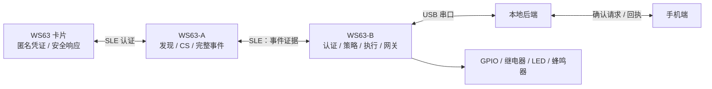
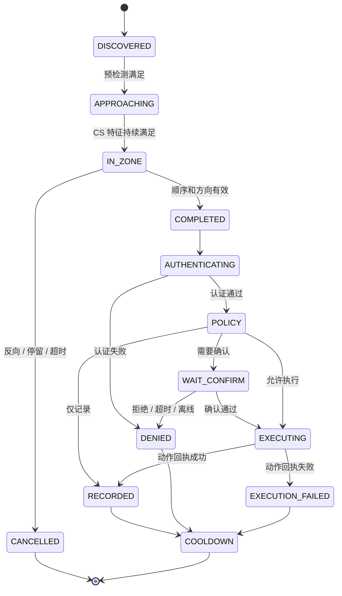

# 硬件端框架设计（V0）

## 1. 运行拓扑



## 2. 固件分层

每一个固件目标都遵循相同分层，避免业务逻辑与硬件 SDK 耦合：

```text
应用层：角色工作流、状态机、策略解释、错误处理
服务层：凭证库、认证、事件队列、命令调度、日志缓存
传输层：SLE 服务、A↔B 帧、USB 帧
平台层：WS63 SDK、CS 原始采样、Flash、RTC、GPIO、USB、看门狗
```

`platform` 只暴露稳定的抽象接口；实际 WS63 SDK 的回调在平台层转为事件，投递给应用层队列。

## 3. 各角色模块

### Card

- `credential_store`：多许可索引、双页/日志式写入、CRC、版本与回滚保护。
- `card_write_service`：手机写卡的准备、分片接收、校验、原子提交、回执。
- `auth_responder`：收到检测端随机挑战后，按许可和会话生成响应；拒绝失效/冻结/撤销凭证。
- `power_manager`：广播窗口、连接窗口和低功耗休眠。

### Detector A

- `discovery`：维护附近目标候选集，不把“发现”当作通行事件。
- `cs_sampler`：采集/归一化 Channel Sounding 原始数据，输出距离、RSSI、质量和时间特征。
- `passage_fsm`：根据两个判断区域/节点的顺序、持续时间和方向，输出 `COMPLETED` 或 `CANCELLED`。
- `evidence_reporter`：把事件 ID、匿名卡片 ID、方向、特征摘要、时间戳和置信度交给 B。

### Detector B

- `event_orchestrator`：接收 A 的完整事件，建立单事件上下文并完成去重。
- `auth_verifier`：发起挑战-响应，校验密钥版本、计数器、有效期、黑名单和策略版本。
- `policy_engine`：仅返回 `RECORD` / `WAIT_CONFIRM` / `EXECUTE` / `DENY` / `ALERT` 等通用决定。
- `confirm_manager`：需要确认时通过 USB 请求后端；拒绝、超时、离线默认不执行。
- `actuator`：驱动 GPIO/继电器，必须读取或模拟外设回执；动作成功与权限成功分别记录。
- `usb_gateway`：心跳、命令应答、配置/黑名单同步、离线日志缓存与补传。

## 4. 关键事件生命周期



## 5. 可靠性与安全边界

- A 到 B 的连接中断：B 不得根据不完整证据放行；事件超时转为取消。
- USB/后端离线：只在许可显式允许离线且本地策略、黑名单均为最新时验证；日志入 Flash 队列。
- 掉电恢复：事件上下文不可恢复为放行；仅恢复已原子提交的凭证、策略和待上传日志。
- 防重放：挑战随机数、会话 ID、单调计数器、有效时间窗和每次认证状态绑定。
- 密钥轮换：凭证同时记录 `key_version` 与 `credential_version`，新旧密钥迁移窗口由 B 的策略控制。

## 6. 第一阶段接口占位

SDK、帧格式和 CS 数据格式未冻结前，先固定语义与 C 接口。实现厂商 SDK 时仅填充 `platform`，不要改动 `common` 的业务对象语义。
